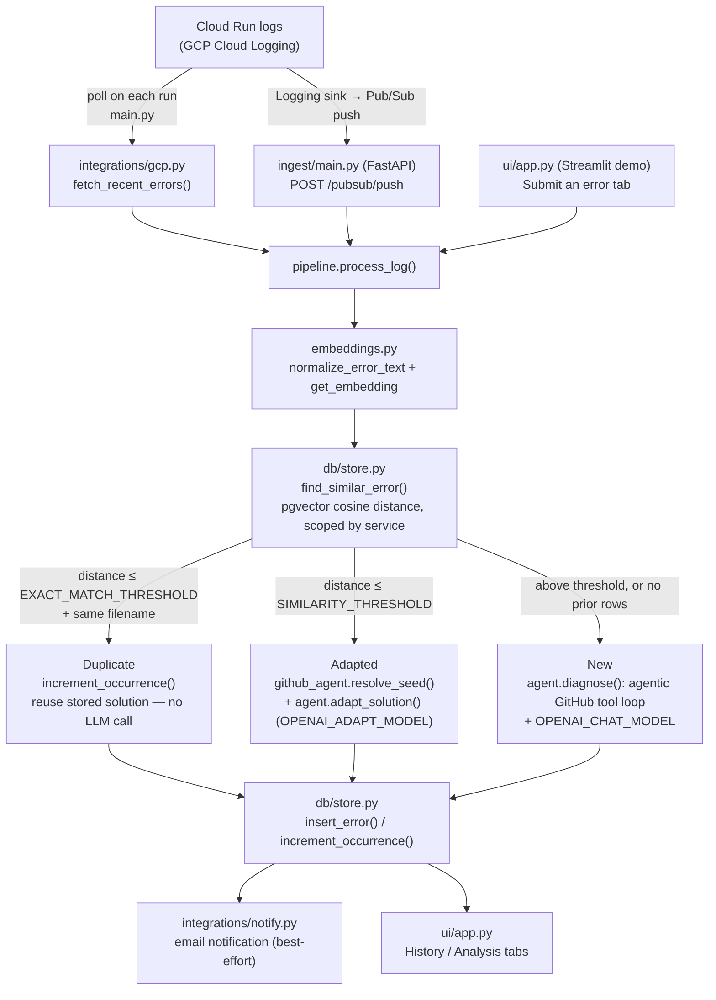

# ProdBot — POC

Watches Cloud Run services for ERROR/CRITICAL logs, dedups each new error
against past ones by embedding similarity, and — for anything that isn't an
exact repeat — fetches the relevant code from GitHub and asks OpenAI for a
diagnosis and fix. Every result (duplicate, adapted, or brand new) is stored
in Postgres, emailed out, and browsable in a Streamlit demo UI.

## How it works



There are two independent ways logs get into the pipeline (`main.py` batch
poll, or `ingest/main.py` Pub/Sub push) and both — plus the Streamlit demo's
"Submit an error" tab — funnel into the same `pipeline.process_log()`, so
there's exactly one place the dedup/retrieval/diagnosis logic lives.

## Setup

1. **Postgres with pgvector** — any Postgres 13+ with the `vector` extension
   available (Cloud SQL supports it; local Docker works too for a POC):
   ```bash
   docker run -d --name errorbot-pg -e POSTGRES_PASSWORD=password \
     -p 5432:5432 pgvector/pgvector:pg16
   ```

2. **Install dependencies**
   ```bash
   pip install -r requirements.txt
   ```

3. **Configure environment**
   ```bash
   cp .env.example .env
   ```
   Required: `DATABASE_URL`, `OPENAI_API_KEY`, `GITHUB_TOKEN`, `GCP_PROJECT_ID`.
   There's no `GITHUB_REPO` var — which repo to pull code from is resolved
   per-service from the `service_repo_map` table (see "Adding more services"
   below), not from an env var.
   Optional: `SMTP_HOST`/`SMTP_USERNAME`/`SMTP_PASSWORD`/`SMTP_FROM_ADDRESS`/
   `NOTIFY_EMAIL_TO` for email notifications — leave blank to skip emailing
   and just store results in Postgres.

4. **Create the schema**
   ```bash
   python -c "from db import store; store.init_db()"
   ```

5. **Run it** — see "Running it" below for the batch job vs. the push
   ingest service.

## Running it

Two ways to feed the pipeline in production, plus the demo UI for manual
testing:

- **Batch poll** (`main.py`) — one-shot: fetches whatever ERROR/CRITICAL logs
  landed in the last `LOG_LOOKBACK_MINUTES` for `CLOUD_RUN_SERVICE`, and
  processes each. Meant to be run on a schedule (cron / Cloud Scheduler).
  ```bash
  python main.py
  ```
- **Push ingest service** (`ingest/main.py`) — a FastAPI app that receives
  Cloud Logging → Pub/Sub push messages at `POST /pubsub/push` and processes
  each log entry as it arrives, instead of polling. Also exposes
  `GET /healthz`. Runs via `Dockerfile.ingest` / `cloudbuild.ingest.yaml`
  (`uvicorn ingest.main:app`); the Cloud Run + Pub/Sub push wiring itself
  (topic, subscription, invoker service account) is set up separately.
  ```bash
  uvicorn ingest.main:app --reload
  ```
  Only run one of these per service at a time — running both would process
  every error twice.

## Demo UI

```bash
streamlit run ui/app.py
```

Runs via `Dockerfile` (`streamlit run ui/app.py`). Three tabs:
- **Submit an error** — paste a raw GCP Cloud Logging LogEntry JSON payload
  (the same shape the push ingest service receives) and run it through the
  real pipeline. Shows whether it was a duplicate, adapted, or new (with the
  cosine distance), which retrieval tier grounded the fix, and the solution
  itself.
- **History** — every row in Postgres so far, most recent first, with the
  full solution and resolution tier per error.
- **Analysis** — KPIs (total errors, repeating errors, most common error
  code) and charts (`ui/analytics.py`): errors over time per service, and
  what fraction of fixes were grounded in real code vs. ungrounded.

This calls the same `pipeline.process_log()` that `main.py` and
`ingest/main.py` use — no separate demo logic, so what you see in the UI is
exactly what production would have done.

## How it decides "duplicate" vs "adapted" vs "new"

Each error is normalized (`error_type | endpoint | message`) and embedded
with OpenAI (`OPENAI_EMBEDDING_MODEL`, default `text-embedding-3-large`),
then compared against the nearest existing row for the same service via
cosine distance (`db.store.find_similar_error`). What happens next depends
on that distance and whether the reported `filename` matches the matched
row's:

1. **Duplicate** (distance ≤ `EXACT_MATCH_THRESHOLD`, `.env`, default `0.02`,
   AND same reported filename as the matched row) — occurrence count goes
   up, the stored solution is reused as-is, and no chat model is called at
   all.
2. **Adapted** (distance between `EXACT_MATCH_THRESHOLD` and
   `SIMILARITY_THRESHOLD`, OR within `EXACT_MATCH_THRESHOLD` but a
   *different* filename — e.g. the same error shape recurring in a new
   file) — one deterministic, non-agentic lookup (`github_agent.resolve_seed`,
   no LLM cost) tries to fetch the new file's own code, then a single
   tools-free call to a cheaper model (`OPENAI_ADAPT_MODEL`, default
   `gpt-4.1-mini`) adapts the matched row's solution to the new error/file.
   Grounded in the new file's real code when it can be resolved; otherwise
   falls back to a text-only, explicitly-flagged-as-unverified adaptation.
   Stored as a **new** row with `resolution_tier='adapted'` and
   `reference_error_id` pointing at the row it was adapted from.
3. **New** (distance above `SIMILARITY_THRESHOLD`, `.env`, default `0.2`,
   or no rows yet for this service) — the full agentic GitHub-retrieval
   diagnosis runs, using `OPENAI_CHAT_MODEL` (default `gpt-4.1`). Stored
   with `resolution_tier='new'`.

**Tune the thresholds before trusting them.** Run the bot against a batch of
real logs, print the distances in `db.store.find_similar_error`, and eyeball
where true duplicates / near-duplicates / genuinely different errors land —
`0.02` and `0.2` are starting points, not calibrated values.

## Email notifications

`integrations/notify.py` sends one email per processed error (duplicate,
adapted, or new), via `smtplib`. Configure `SMTP_HOST`, `SMTP_USERNAME`,
`SMTP_PASSWORD`, `SMTP_FROM_ADDRESS`, and `NOTIFY_EMAIL_TO` (comma-separated
list) in `.env`; if `SMTP_HOST` or `NOTIFY_EMAIL_TO` is unset, notification is
skipped entirely. Best-effort by design — any failure (bad creds, SMTP
downtime) is logged and swallowed rather than raised, so a broken mail
server never breaks error processing itself.

## Adding more services

Retrieval is scoped per-service via `service_repo_map` in `db/schema.sql`, keyed
on the Cloud Run service name (must match `resource.labels.service_name` in
the logs exactly). Seed rows: `cricket-fever` → `TaherVora/cricket-fever` and
`beer-service` → `TaherVora/Beer-service`.

To onboard another service, add a row:
```sql
INSERT INTO service_repo_map (service_name, repo, path_prefix, default_branch)
VALUES ('checkout-service', 'your-org/checkout-service', NULL, 'main');
```

If a service has no row here, retrieval falls back to no code context
rather than guessing a repo — same principle as the retrieval tiers
themselves. `GITHUB_TOKEN` needs read access to every repo listed in this
table (a single fine-grained token scoped to just those repos, not the
whole org, so a mapping mistake can't accidentally read a repo it
shouldn't).

Dedup (`db.store.find_similar_error`) is also scoped by `service_name`, so two
different services returning a similar generic error won't get deduped
against each other.

## How code retrieval works

A cheap deterministic seed step (`integrations/github.py`), then a bounded
agentic tool-calling loop (`integrations/github_agent.py`) that can pull in
more files than just the one the seed step found:

1. **Seed** — if the log names a filename directly, try fetching it as a
   repo-relative path; if that doesn't resolve (or it's a bare filename, as
   compiled-language apps always report), resolve the real path by listing
   the repo's file tree and matching on filename. No filename, or nothing
   matches → no seed file, and the model gets the repo's file tree instead
   of guessing. (GitHub's code-search API is deliberately *not* part of this
   step — see the module docstring in `integrations/github_agent.py` for why
   a prior version that used it as a fallback here was removed.)
2. **Agentic loop** — the model gets read-only tools (`get_file_contents`,
   `find_file_by_name`, `list_directory`, `search_code`, all scoped to the
   one repo already resolved for this service) and decides what else it
   needs — repository/DTO files a fix also touches, or files it has to
   search for because the seed step found nothing, in any language. Bounded
   by `MAX_TOOL_CALL_ROUNDS`, `MAX_FILES_PER_ERROR`, and
   `GITHUB_AGENT_TIMEOUT_SECONDS` so it can't run away. `search_code` itself
   is a last resort (lower rate limit than the other tools) and gets
   disabled for the rest of a diagnosis the first time it's rate-limited.
3. If nothing was found at all, the model is told explicitly and gives a
   general, pattern-based suggestion rather than guessing at code it hasn't
   seen. Every file actually used is stored per-error in `source_files`
   (Postgres array column) and shown in the demo UI.

## Deployment

Two separate container images, one per production entry point:
- `Dockerfile` — the Streamlit demo (`streamlit run ui/app.py`).
- `Dockerfile.ingest` + `cloudbuild.ingest.yaml` — the push ingest service
  (`uvicorn ingest.main:app`), built via Cloud Build.

Both expect the same `.env` configuration (Cloud Run env vars / secrets in
practice) and the Postgres schema already created via `store.init_db()`.

## Not in this POC (by design)

- Slack/Teams notification — email is implemented (`integrations/notify.py`);
  Slack is not.
- GitHub MCP server to get write tools if user wants to update code and create PR (Not recommended for Production)

## Note for Judges

- Please contact me for api keys if you want to test, I have few credits left on my keys.
- To run this project you will need a sample project and run the SKILL.md file to match the format of the logs ProdBot is expecting.